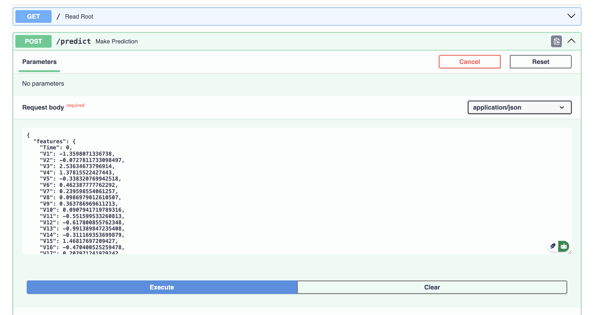
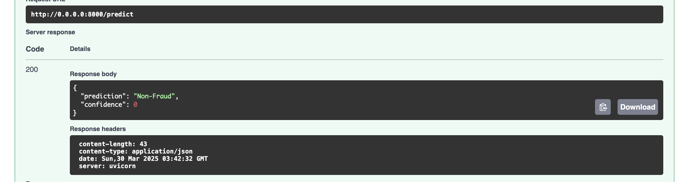
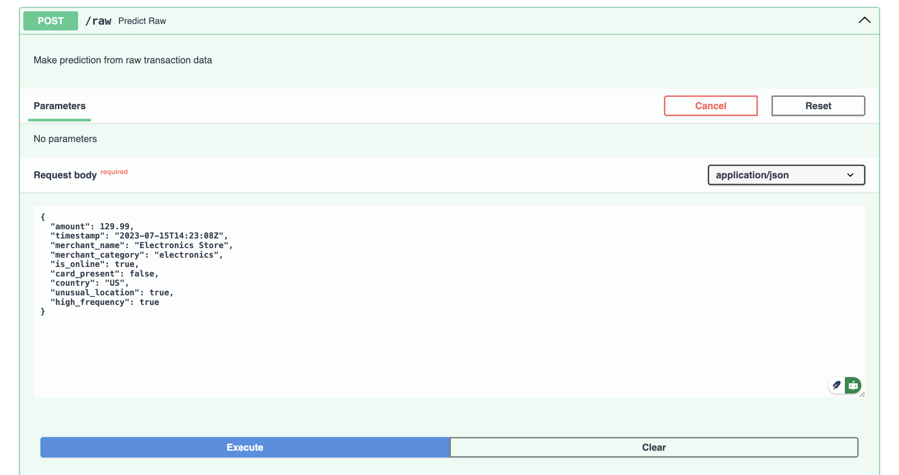
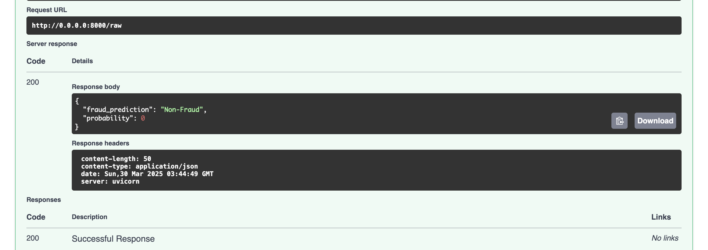

# Fraud Detection API

This is a machine learning API for detecting fraudulent credit card transactions.

## Deployment Instructions

### Render Deployment

1. Sign up for a Render account at [render.com](https://render.com)
2. Create a new Web Service and connect your GitHub repository
3. Set the following configuration:
## Build Command: 
`pip install -r requirements.txt`

## Start Command: 
```
uvicorn api.index:app --reload --port 8000 --lifespan on
```


Note: Render will automatically detect the `requirements.txt` file and install dependencies.

### API Endpoints
1. Make a prediction by providing a transformed transaction data


- The response body is as follows:


2. Make a prediction by providing raw transaction data


- The response body is as follows:

